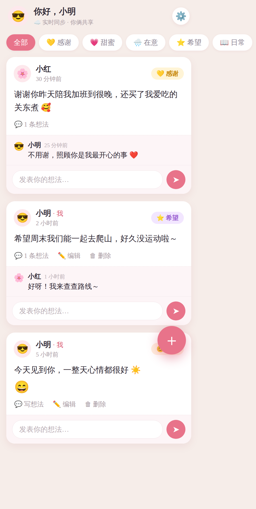

# 我们的记录 · 二人反馈日记 💞（微信小程序 + 云开发）

一个给情侣两个人用的**共享反馈记录本**：你和 TA 在微信里各自打开，实时看到彼此写下的每一条记录，还能在每条记录下面**互相发表想法**。

> 为什么用微信小程序：国内网络最稳，微信一键登录（不用记密码），实时同步快，**不用买服务器、不用域名、不用备案**。你俩用「体验版」就能直接用，外人打不开，天然私密。

<p align="center">
  
</p>

---

## ✨ 功能

- 👫 **两人实时互通**：一方写下，另一方微信里马上看到（云开发实时数据库）
- 🏷️ **多种记录类型**（可自定义）：💛感谢　💗甜蜜　🌧️在意　⭐希望　📖日常　😊心情打卡
- 💬 **互相发表想法**：每条记录下面都能评论回应
- 😊 **心情打卡**：选「心情」类型时打 1–5 分
- ✏️ 自己的记录可编辑 / 删除（删除会连带删掉下面的想法）
- 🔑 微信一键登录，免密码；首次进来设置昵称 + emoji 头像
- 🔒 只有你俩能看（不发布小程序，只用体验版 + 数据库安全规则）

---

## 🗂️ 记录表设计（字段说明）

这就是你要的「记录表」。云开发是文档型数据库，共 3 个集合：

**`records`（记录 · 核心）**

| 字段 | 含义 |
|---|---|
| `_openid` | 谁写的（微信自动写入，用来判断"是不是我"） |
| `author_name` / `author_emoji` | 昵称、头像（写时快照，方便显示） |
| `type` | 记录类型：`thanks/happy/care/wish/daily/mood`（可自定义） |
| `mood` | 心情分数 1–5（仅「心情」类型用） |
| `content` | 正文（想记录/反馈的内容） |
| `createTime` / `updateTime` | 时间（服务器时间） |

**`comments`（想法/回应）**：`recordId`（属于哪条记录）、`_openid`、`author_name`、`author_emoji`、`content`、`createTime`

**`profiles`（个人资料）**：`_openid`、`name`（昵称）、`emoji`（头像）

> 想加/改「记录类型」：改 `miniprogram/utils/util.js` 顶部的 `RECORD_TYPES` 即可，**不用动数据库**。

---

## 🚀 完整搭建步骤（跟着做，约 20–30 分钟）

### 准备
1. **注册小程序账号**：电脑打开 <https://mp.weixin.qq.com> → 立即注册 → 选「小程序」→ 用邮箱注册（个人主体即可，免费）。注册后在 **开发管理 → 开发设置** 里能看到 **AppID**。
2. **下载微信开发者工具**：<https://developers.weixin.qq.com/miniprogram/dev/devtools/download.html>，用你注册的微信扫码登录。

### 第 1 步：把项目导入开发者工具
- 把本仓库下载/克隆到电脑上
- 微信开发者工具 → **导入项目** → 目录选**本仓库根目录**（有 `project.config.json` 那层）→ AppID 填你自己的 → 确定

### 第 2 步：开通云开发，拿到环境 ID
1. 开发者工具顶部点 **云开发** → 按提示**开通**（新用户有免费额度，够两个人用很久）
2. 开通后进入云开发控制台，首页能看到 **环境 ID**（形如 `your-env-xxxxxxxx`）
3. 打开 `miniprogram/config.js`，把 `ENV_ID` 换成你的环境 ID：
   ```js
   module.exports = { ENV_ID: "你的环境ID" };
   ```

### 第 3 步：建 3 个数据集合 + 设置权限
在云开发控制台 → **数据库** → **集合管理**，点「+」新建 3 个集合（名字要一模一样）：
`records`、`comments`、`profiles`

每个集合建好后，点它 → **权限设置** → 选「**自定义安全规则**」→ 粘贴下面内容（3 个集合都一样）：
```json
{
  "read": true,
  "write": "doc._openid == auth.openid"
}
```
> 含义：你俩都能读，但只能改/删自己写的。（现成 JSON 见 `db-rules/` 目录）

### 第 4 步：上传部署 2 个云函数
在开发者工具左侧文件树里，展开 `cloudfunctions`：
1. **右键 `login`** → 「**上传并部署：云端安装依赖**」
2. **右键 `deleteRecord`** → 「**上传并部署：云端安装依赖**」

> `login` 用来拿你的身份；`deleteRecord` 用来删记录时连带删掉下面的想法。

### 第 5 步：预览、首次设置
- 点开发者工具的 **编译**，模拟器里就能看到界面
- 第一次进来会让你**设置昵称和头像**，设置完就能用了
- 点 **预览**，用手机微信扫码，在真机上试

### 第 6 步：让对方也能用（体验版）
1. 开发者工具点右上角 **上传** → 填个版本号和备注
2. 到 <https://mp.weixin.qq.com> → **管理 → 版本管理** → 把刚上传的版本**选为体验版**
3. **管理 → 成员管理 → 体验成员** → 把对方的微信号加进来
4. 生成**体验版二维码**发给对方，对方扫码即可打开使用 🎉

> 你俩用的是同一个小程序、同一个云环境，所以能互相看到记录、互相回应。

---

## 🔒 隐私与安全（重要）

- **不用把小程序提交发布上线**，一直用「体验版」即可——只有你加进「体验成员」的人（也就是你俩）能打开，外人根本进不来。
- 数据库安全规则限制了：只能改/删自己写的内容。
- 数据存在你自己的云开发环境里（你的账号名下）。
- 如果将来你确实想正式发布给更多人用，请把 `db-rules` 里的 `"read": true` 改成只允许你俩的 openid，否则任何用户都能读到你们的记录。

---

## 🎨 想自己改

- **加/改记录类型**：`miniprogram/utils/util.js` 里的 `RECORD_TYPES`
- **改主题色**：`miniprogram/pages/index/index.wxss`（主色 `#e8738a`）
- **改小程序名字/图标**：在 <https://mp.weixin.qq.com> 的「基本设置」里改

---

## 📁 文件结构

```
├── project.config.json         # 项目配置（导入时填你的 AppID）
├── miniprogram/                # 小程序前端
│   ├── app.js / app.json / app.wxss
│   ├── config.js              # ★ 填你的云开发环境 ID
│   ├── utils/util.js          # 记录类型、心情、工具函数
│   └── pages/index/           # 主页面（记录流 / 写记录 / 评论 / 设置）
├── cloudfunctions/            # 云函数
│   ├── login/                 # 返回 openid
│   └── deleteRecord/          # 删记录并级联删想法
├── db-rules/                  # 3 个集合的数据库安全规则（复制粘贴用）
└── web/                       # 【备用】早期的网页版（用境外 Supabase，国内不稳，仅存档参考）
```

---

## ❓ 常见问题

- **进去一直转圈 / 提示没拿到身份**：多半是 `config.js` 的环境 ID 没填对，或 `login` 云函数没「上传并部署」。
- **写记录/评论报"保存失败"**：多半是 3 个集合没建全，或集合名字拼错。
- **对方打不开**：确认已把对方加为「体验成员」，且发的是「体验版」二维码。
- **看不到对方的记录**：确认你俩用的是同一个 AppID、同一个云环境。

---

祝你们记录愉快，越来越懂彼此 💕
