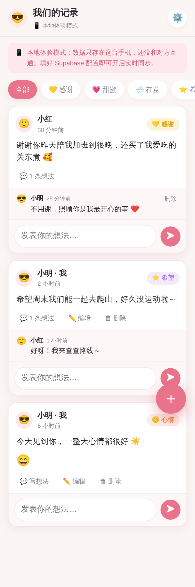

# 我们的记录 · 二人反馈日记 💞

一个给情侣两个人用的**共享反馈记录本**：你和 TA 各自登录，实时看到彼此写下的每一条记录，还能在每条记录下面**互相发表想法**。手机上打开即可用，可"添加到主屏"当 App。

<p align="center">
  
</p>

> 「通过记录充当反馈」——不是冷冰冰的表格，而是把感谢、甜蜜、在意的小事、对彼此的期待都记下来，让对方看见，也能回应。

---

## ✨ 有什么功能

- 📱 **手机网页 App**：任何手机浏览器打开就能用，可加到主屏，像 App 一样
- 👫 **两个人实时互通**：一方写下，另一方手机上马上刷新看到（云端同步）
- 🏷️ **多种记录类型**（可自定义）：
  - 💛 感谢　💗 甜蜜　🌧️ 在意　⭐ 希望　📖 日常　😊 心情打卡
- 💬 **互相发表想法**：每条记录下面都能评论回应，像小小的对话
- 😊 **心情打卡**：选类型「心情」时可以打 1–5 分的心情
- ✏️ 自己的记录可以编辑 / 删除
- 🌙 自动适配深色模式
- 🔒 只有你俩能看（数据库行级安全 + 关闭陌生人注册）

---

## 🗂️ 记录表怎么设计的（字段说明）

这就是你要的「记录表」结构，都在 [`supabase/schema.sql`](supabase/schema.sql) 里，可自行增减字段。

**records（记录表 · 核心）**

| 字段 | 含义 | 说明 |
|---|---|---|
| `id` | 记录编号 | 自动生成 |
| `user_id` | 谁写的 | 关联登录账号，用来判断"是不是我写的" |
| `author_name` | 昵称快照 | 写的时候记下昵称，方便显示 |
| `type` | 记录类型 | `thanks/happy/care/wish/daily/mood`，可自定义 |
| `mood` | 心情分数 | 1–5，仅「心情」类型用，其它留空 |
| `content` | 正文 | 你想记录/反馈的内容 |
| `created_at` | 记录时间 | 自动 |
| `updated_at` | 修改时间 | 自动 |

**comments（想法/回应表）**：`record_id`（属于哪条记录）、`user_id`、`author_name`、`content`、`created_at`

**profiles（个人资料）**：`display_name`（昵称）、`avatar_emoji`（头像 emoji）

> 想增删「记录类型」：改 [`app.js`](app.js) 顶部的 `RECORD_TYPES` 数组即可（比如加一个「道歉 🙇」类型），不用改数据库。

---

## 🚀 快速开始

### 方式一：先本地体验（0 配置，1 分钟）

不填任何配置，App 会自动进入「本地体验模式」，数据只存在本机，方便先看看界面和交互。

- 电脑上：在项目文件夹里跑一个小服务器，然后浏览器打开
  ```bash
  # 二选一
  python3 -m http.server 8000
  # 或 npx serve .
  ```
  打开 <http://localhost:8000>

> 本地模式只有你自己能看到、不能和对方互通。想两个人实时同步，请继续看方式二。

### 方式二：开启云端实时互通（推荐，约 10–15 分钟）

需要一个免费的 [Supabase](https://supabase.com) 项目当后端。跟着做即可：

#### 第 1 步：建 Supabase 项目
1. 打开 <https://supabase.com> → 用 GitHub / 邮箱注册登录
2. 点 **New project**，随便起个名字，数据库密码自己设一个（记好），地区选离你近的（如 Singapore）
3. 等 1–2 分钟，项目创建完成

#### 第 2 步：建好数据表（运行一次 SQL）
1. 左侧菜单 → **SQL Editor** → **New query**
2. 打开本项目的 [`supabase/schema.sql`](supabase/schema.sql)，**全部复制**粘贴进去
3. 点 **Run**（右下角），看到成功即可 ✅

#### 第 3 步：拿到连接信息，填进 config.js
1. 左侧 → **Project Settings**（齿轮）→ **API**
2. 复制两样东西：
   - **Project URL**
   - **Project API keys** 里的 **anon public**
3. 打开本项目的 [`config.js`](config.js)，把两处替换成你的值：
   ```js
   window.APP_CONFIG = {
     SUPABASE_URL: "https://你的项目.supabase.co",
     SUPABASE_ANON_KEY: "你的 anon public key",
   };
   ```
   > 放心：anon key 本来就是给前端用、可公开的，真正的保护靠数据库里的 RLS 规则（schema 已配好）。

#### 第 4 步（重要 · 安全）：只让你俩能进
1. 左侧 → **Authentication** → **Sign In / Providers** → **Email**
2. **（可选，建议）** 关闭 **Confirm email**：这样注册后能直接登录，不用去邮箱点链接
3. **你俩都注册完账号之后**，回到这里关闭 **Allow new users to sign up**（禁止陌生人再注册），这样就只有你们两个能进了 🔒

#### 第 5 步：你和对方各注册一个账号
- 把网站发给对方（见下面「部署」），你们各自用邮箱 + 密码注册，填上昵称
- 只要是**同一个 Supabase 项目**，你俩就能互相看到记录、互相回应 🎉

---

## 🌐 部署到手机（让两个人都能打开）

App 需要一个网址才能在两部手机上打开。选一个免费方式：

### 选项 A：GitHub Pages（代码已经在 GitHub，最省事）
1. GitHub 仓库 → **Settings** → **Pages**
2. **Source** 选 `Deploy from a branch`，分支选本分支（或先合并到 `main`），目录选 `/ (root)`，保存
3. 等一会儿会给你一个网址，形如 `https://用户名.github.io/仓库名/`
4. 手机浏览器打开这个网址即可

### 选项 B：Netlify / Vercel（拖拽即部署）
- 打开 [netlify.com](https://app.netlify.com/drop)，把整个项目文件夹拖进去，秒出网址
- 或用 [vercel.com](https://vercel.com) 导入这个 GitHub 仓库

> ⚠️ 一定要用 **https** 网址（GitHub Pages / Netlify / Vercel 都自带 https）。PWA「添加到主屏」和登录都需要 https。

### 添加到主屏（像 App 一样用）
- **iPhone（Safari）**：打开网址 → 点分享 ⬆️ → 「添加到主屏幕」
- **安卓（Chrome）**：打开网址 → 右上角菜单 → 「添加到主屏幕 / 安装应用」

---

## 🎨 想自己改

- **加/改记录类型**：改 `app.js` 顶部的 `RECORD_TYPES`
- **改主题色**：改 `styles.css` 里 `--brand` 等颜色变量
- **改 App 名字/图标**：改 `manifest.json` 和 `icons/icon.svg`（改图标后可用 `node scripts/gen-icons.mjs` 重新生成 PNG）

---

## 🔐 关于隐私和安全

- 数据存在你自己的 Supabase 项目里（你的账号名下），不经过任何第三方
- 数据库开了**行级安全（RLS）**：只有登录用户能读写，且只能改删自己写的内容
- 记得按第 4 步**关闭陌生人注册**，App 就只有你们两个人能进
- anon key 可以公开放在前端，这是 Supabase 的设计，安全性由 RLS 保证

---

## 📁 文件结构

```
├── index.html          # 页面外壳
├── app.js              # 全部前端逻辑（云端 + 本地两种模式）
├── styles.css          # 样式（手机优先 / 深色模式）
├── config.js           # 填你的 Supabase 连接信息（没填=本地模式）
├── config.example.js   # 配置模板
├── manifest.json       # PWA 配置（添加到主屏）
├── sw.js               # Service Worker（离线打开外壳）
├── icons/              # App 图标
├── supabase/
│   └── schema.sql      # 数据库建表 + 安全规则（记录表设计）
└── scripts/
    └── gen-icons.mjs   # 由 SVG 生成 PNG 图标（可选）
```

---

祝你们记录愉快，越来越懂彼此 💕
